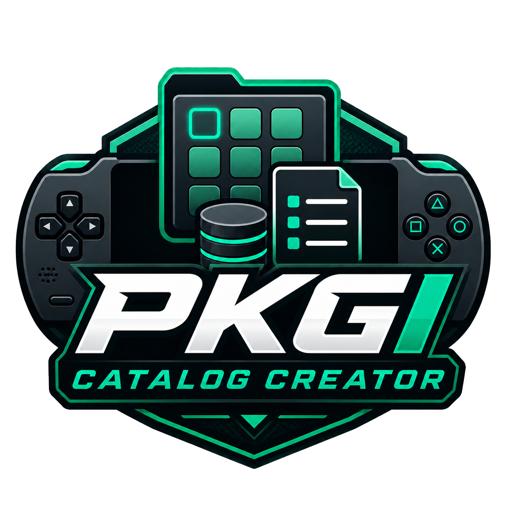

# PKGI Catalog Creator

  

**Build, validate, and export PKGI Enhanced catalog files for PSP games, PSX, media, homebrew, apps, emulators, and Archive.org collections from one desktop app.**

## Download

Download the latest Windows installer from the [Releases page](https://github.com/ZoneJ561/pkgi-catalog-creator/releases/latest).

PKGI Catalog Creator is made for building PSP PKGI Enhanced catalog files without hand-writing CSV rows. Add direct links, resolve Archive.org files, import NoPayStation TSV files, validate entries, preview the generated catalog, and export the correct `.txt` files for the PSP app.

## Features

### Catalog Projects

- Create and save editable catalog projects.
- Add, copy, remove, and batch-change item categories.
- Preview PKGI-compatible rows before exporting.
- Validate required fields, HTTP links, size values, and checksums.
- Export all catalogs at once, a selected catalog file, or a ZIP bundle.

### Link And File Support

- Resolve Archive.org collection links into final PSP-friendly direct HTTP links.
- Pick which files to add from large Archive.org collections.
- Detect byte sizes from linked files.
- Calculate SHA-256 checksums from URLs or local files.
- Import local PKGI `.txt` files and NoPayStation PSP/PSX TSV files.
- Filter NoPayStation rows with missing files or non-PKG links.

### PSP Categories

- Game ISO and CSO entries export through `pkgi_games.txt`.
- NPS PSP games and NPS PSX packages use separate NPS catalog files.
- Movie/video UMD ISOs stay separate from game ISOs.
- Music Album ZIPs, PSX ZIPs, Movie ZIPs, TV Show ZIPs, and Homebrew ZIPs stay in their matching catalog files.
- Apps and emulators use their own ZIP package catalogs.
- Homebrew uses `pkgi_homebrew.txt` and accepts ZIP packages only.

### Updates

- Check for app updates from inside PKGI Catalog Creator.
- Download the latest Windows installer directly from GitHub Releases.
- Use one stable public release stream for everyone.

## What Each `.txt` File Is For

PKGI Enhanced reads different catalog files for different content sections. PKGI Catalog Creator exports the correct filename automatically so users do not have to rename anything by hand.

| Catalog file | What it contains | PSP destination / behavior |
| --- | --- | --- |
| `pkgi.txt` | Combined catalog containing every exported row | General combined list |
| `pkgi_games.txt` | PSP game `.iso` and `.cso` entries | Saves to `ms0:/ISO` |
| `pkgi_nps_games.txt` | NoPayStation PSP game `.pkg` entries | Installed through PKGI Enhanced |
| `pkgi_nps_psx.txt` | NoPayStation PSX `.pkg` entries | Installed through PKGI Enhanced |
| `pkgi_dlcs.txt` | PSP DLC `.pkg` entries | Installed through PKGI Enhanced |
| `pkgi_themes.txt` | PSP theme `.pkg` entries | Installed through PKGI Enhanced |
| `pkgi_updates.txt` | PSP update `.pkg` entries | Installed through PKGI Enhanced |
| `pkgi_demos.txt` | PSP demo entries | Installed or downloaded through PKGI Enhanced |
| `pkgi_psx.txt` | PSX entries, including PSX ZIP packages | Handled by PKGI Enhanced |
| `pkgi_movies.txt` | PSP-ready `.mp4`, `.m4v`, `.avi`, and Movie ZIP entries | Downloads to the video folder; ZIPs extract there |
| `pkgi_movie_iso.txt` | PSP UMD Video ISO/CSO files | Saves to `ms0:/ISO/VIDEO` |
| `pkgi_music.txt` | Loose music files and Music Album ZIPs | Downloads to the music folder; ZIP albums extract cleanly |
| `pkgi_music_videos.txt` | PSP-ready music videos | Saves to `ms0:/VIDEO` |
| `pkgi_tv_shows.txt` | PSP-ready TV episodes and TV Show ZIPs | Downloads to the video folder; ZIPs extract there |
| `pkgi_wallpapers.txt` | PSP wallpaper images like JPG, PNG, BMP, and GIF | Saves to `ms0:/PSP/PHOTO` |
| `pkgi_emulators.txt` | Emulator ZIP packages | User-selected folder in PKGI Enhanced |
| `pkgi_apps.txt` | Application ZIP packages | User-selected folder in PKGI Enhanced |
| `pkgi_homebrew.txt` | Homebrew ZIP packages only | Handled by PKGI Enhanced |
| `dbformat.txt` | Field layout used by PKGI | Exported with catalog bundles |
| `config.sample.txt` | Example PSP-side config notes for the exported files | Reference file only |

Legacy imports of older `pkgi_isos.txt`, `pkgi_csos.txt`, and `pkgi_zips.txt` are remapped into the current categories where possible.

## Getting Started

1. Download and run the latest installer from the [Releases page](https://github.com/ZoneJ561/pkgi-catalog-creator/releases/latest).
2. Open PKGI Catalog Creator and create or open a saved project.
3. Add direct links, import a PKGI `.txt`, import a NoPayStation TSV, or paste an Archive.org collection link.
4. Review the catalog preview and validation panel.
5. Export the selected `.txt` file, all catalog files, or a ZIP bundle for your PSP setup.

## Platform Support

| Platform | Status |
| --- | --- |
| Windows | Available |
| macOS | Build workflow prepared; unsigned test build support can be added to releases |

## Important Note

Use PKGI Catalog Creator only with content that you own, created, or have permission to download and distribute. You are responsible for following the terms that apply to any linked files, archives, and services you use.

PKGI Catalog Creator is an independent project. It is not affiliated with, sponsored by, or endorsed by Sony, Archive.org, NoPayStation, or the upstream PKGI projects.

## Project Updates And Support

- Follow the project creator on Instagram: [@God1yNigga](https://instagram.com/god1ynigga)
- Support development through Venmo: [venmo.com/godlynigga](https://venmo.com/godlynigga)

## About This Repository

This is the public release page for PKGI Catalog Creator. Downloadable installers are published through [GitHub Releases](https://github.com/ZoneJ561/pkgi-catalog-creator/releases). The application source code and private build workflow are maintained separately while the app is being polished.
